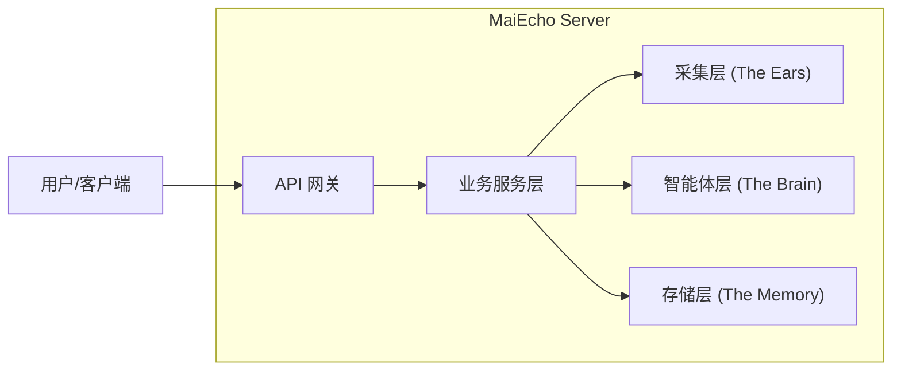

# MaiEcho 🎵

<div align="center">


**听见谱面的声音 | Hear the Echo of Charts**

MaiEcho 是一个开源的音游舆情分析智能体框架，专注于 **舞萌（maimai）** 乐曲与谱面评价的综合分析。

[功能特性](#-功能特性) • [快速开始](#-快速开始) • [文档中心](docs/documentation_index.md) • [架构设计](#-架构设计) • [API 文档](#-api-文档) • [贡献指南](#-贡献指南)

</div>

---

## 📖 简介 (Introduction)

**MaiEcho** 不仅仅是一个爬虫，它是一个懂音游的 **AI 智能体**。

关于音游谱面的评价，常散落在 Bilibili 视频评论、贴吧讨论和各种 Wiki 中。新手玩家往往难以从海量的“黑话”和情绪化发言中获取有价值的信息。

MaiEcho 参考了舆情监测系统的原理，通过以下流程解决这个问题：

1. **听 (Listen)**: 从社交媒体抓取关于特定乐曲的评论数据。
2. **想 (Think)**: 利用大语言模型理解音游术语，去除参考价值较小的噪声。
3. **分 (Sort)**: 智能区分 **DX** 与 **标准** 谱面，避免张冠李戴。
4. **说 (Speak)**: 生成结构化的谱面简介、难点解析及推分建议。

> 本项目设计灵感来源于 Github "微舆" 项目框架，针对音游垂直领域进行了深度定制。

## ✨ 功能特性 (Features)

* **懂黑话的 AI 分析**: 内置音游术语知识库，能理解“鸟加”、“纵连”、“海底潭”、“绝赞”等专业术语，从杂乱的评论中提取核心观点。
* **智能分桶 (Bucket Analysis)**: 独创的上下文解析算法，自动根据视频标题将评论归类到正确的谱面版本（DX/标准）和难度（Expert/Master/Re:Master），拒绝评价混淆。
* **多源数据采集**:
  * **Bilibili**: 支持视频评论、动态抓取。
  * *(计划中)*: 百度贴吧、小红书、抖音。
* **数据同步**: 集成 **Diving-Fish (水鱼)** API，自动同步最新的乐曲列表、定数及拟合难度数据。
* **细粒度报告**: 不仅提供歌曲维度的宏观评价，更提供具体到每一个谱面（Chart）的微观攻略。
* **RESTful API**: 提供标准的 HTTP 接口，易于集成到前端网页或 QQ/微信 机器人中。

## 🛠️ 技术栈 (Tech Stack)

* **Language**: Golang 1.21+
* **Web Framework**: Gin
* **Database**: SQLite (Default) / PostgreSQL (Supported) + GORM
* **Crawler**: Colly + Go-Rod
* **LLM SDK**: OpenAI-Go (Compatible with DeepSeek, Qwen, etc.)
* **Config**: Viper

## 🚀 快速开始 (Quick Start)

### 前置要求

* Go 1.21 或更高版本
* Git
* 一个兼容 OpenAI 接口的 API Key (如 OpenAI, DeepSeek, 阿里云 DashScope)

### 安装步骤

1. **克隆仓库**

   ```bash
   git clone https://github.com/your-username/MaiEcho.git
   cd MaiEcho
   ```
2. **配置环境**
   复制配置文件模板并修改：

   ```bash
   cp server/config/config.example.yaml server/config/config.yaml
   ```

   编辑 `server/config/config.yaml`，填入你的 LLM API Key 和数据库配置。
3. **运行服务**

   ```bash
   go mod tidy
   go run ./server/cmd/maiecho
   ```
4. **验证**
   访问 `http://localhost:8080/api/v1/system/status`，如果返回 `{"status": "ok"}` 则启动成功。

## 🏗️ 架构设计 (Architecture)

MaiEcho 采用模块化分层架构，确保各组件职责单一且易于扩展。



* **Collector**: 负责“听”。实现了指数退避重试、WAF 绕过和数据清洗。
* **Agent**: 负责“想”。采用 **Split-Apply-Combine** 策略，对不同谱面的评论进行独立分析后再聚合。
* **Service**: 负责“做”。协调各模块，对外提供业务接口。

## 📚 文档 (Documentation)

MaiEcho 提供了详细的开发文档和使用指南，请访问 **[文档中心 (Documentation Index)](docs/documentation_index.md)** 查看完整列表。

### 核心文档
* **[架构设计](docs/modules/server/architecture.md)**: 了解系统的整体架构和模块划分。
* **[API 参考](docs/api/api_reference.md)**: 详细的 HTTP 接口定义和参数说明。
* **[CLI 工具指南](test/cli/README.md)**: 命令行测试工具的使用说明。

**常用 API 示例**:

* **获取乐曲分析结果**:
  `GET /api/v1/analysis/songs/:id`
* **触发乐曲采集任务**:
  `POST /api/v1/collect`
  ```json
  { "game_id": 114514 }
  ```

## 🗺️ 开发路线 (Roadmap)

- [X]  **Phase 1: 核心框架**
  - [X]  基础爬虫 (Bilibili)
  - [X]  数据库模型设计 (Song/Chart/Comment)
  - [X]  LLM 接入与 Prompt 工程
- [X]  **Phase 2: 精度优化**
  - [X]  智能分桶分析 (DX/Std 分离)
  - [X]  聚合分析 API
- [ ]  **Phase 3: 扩展与生态**
  - [ ]  支持更多数据源 (贴吧、Wiki)
  - [ ]  向量数据库支持 (语义搜索)
  - [ ]  Web 可视化前端
  - [ ]  新歌数据增量更新

## 🤝 贡献 (Contributing)

欢迎提交 Issue 和 Pull Request！

1. Fork 本仓库
2. 创建你的特性分支 (`git checkout -b feature/AmazingFeature`)
3. 提交你的修改 (`git commit -m 'Add some AmazingFeature'`)
4. 推送到分支 (`git push origin feature/AmazingFeature`)
5. 开启一个 Pull Request

此外，欢迎基于此项目开发适用于其他音乐游戏的社区项目~可提Issue咨询！

## 📄 许可证 (License)

本项目采用 [MIT 许可证](LICENSE)。

## 🙏 致谢 (Acknowledgements)

* **Diving-Fish (水鱼)**: 提供了详尽的 maimai 乐曲与定数数据。
* YuzuChan: 提供了全面的歌曲别名数据。
* **微舆**: 本项目的架构设计参考了微舆情监测系统的理念。
* **Maimai DX**: 感谢 SEGA、华立科技 带来优秀的音乐游戏。

---

<div align="center">
Made with ❤️ by MaiEcho Team
</div>
