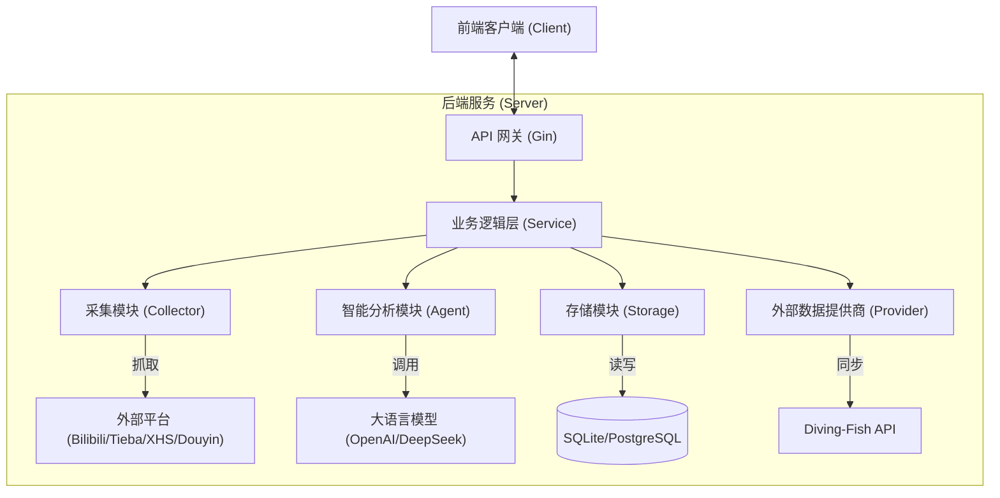

# MaiEcho 模块功能与架构设计文档

本文档详细描述了 MaiEcho 项目的模块划分、功能定义及技术架构，旨在指导后续的 Vibe Coding 开发流程。

## 1. 总体架构 (Overall Architecture)

MaiEcho 采用典型的分层架构，各层职责单一，通过接口解耦。

## 2. 模块详解 (Module Details)

### 2.1 数据采集层 (Collector Layer) - "The Ears"

负责从外部社交媒体平台获取原始舆情数据。

* **核心功能**:
  * **Scraper Interface**: 定义统一的采集接口 `Collect(target string) error`。
  * **Bilibili Scraper**: 针对 B 站视频、动态、评论区的采集器。
    * **WAF 绕过**: 实现 Cookie 管理与请求头伪装。
    * **数据清洗**: 自动剥离 HTML 标签（如 `<em>`），提取纯文本。
    * **ID 稳定性**: 优先使用 `rpid` 作为评论唯一标识，确保去重准确。
  * **Xiaohongshu Scraper**: (开发中) 针对小红书笔记与评论的采集器。
  * **Douyin Scraper**: (论证中) 针对抖音短视频评论的采集器。
  * **Tieba Scraper**: (论证中) 针对百度贴吧的采集器。
  * **Task Scheduler**: 基于 Cron 的任务调度，支持定时抓取或按需触发抓取任务。
* **技术栈**: `Colly` (基础爬虫), `Exponential Backoff` (重试机制)。

### 2.2 智能分析层 (Agent Layer) - "The Brain"

负责将非结构化的文本数据转化为结构化的洞察建议。采用 **"分桶分析" (Bucket Analysis)** 架构，解决不同谱面版本（DX/Std）与难度混淆的问题。

* **核心功能**:
  * **LLM Client**: 独立封装的 `internal/llm` 包，基于 `openai-go` SDK，支持 DashScope (Qwen) 等兼容 OpenAI 协议的模型。
  * **Prompt Manager**: 管理不同场景的提示词模板（如：总结、情感分析、建议生成）。
  * **Analysis Pipeline (分桶策略)**:
    1. **Context Parsing**: 解析视频标题，提取谱面上下文（如 "DX Master", "Std Re:Master"）。
    2. **Bucketing**: 将评论按关联的谱面 ID 分桶，无法关联的归入歌曲通用桶。
    3. **Independent Analysis**: 对每个桶独立调用 LLM 进行分析，生成针对特定谱面的建议。
    4. **Aggregation**: 最终聚合为“歌曲总览”+“各谱面详情”的结构化报告。
* **技术栈**: `OpenAI-Go SDK`, `Regex` (上下文提取)。

### 2.3 存储层 (Storage Layer)

负责数据的持久化。

* **核心功能**:
  * **Schema Design**: 维护 `Song`, `Chart`, `Comment`, `AnalysisResult` 等数据模型。
  * **Granular Storage**: `AnalysisResult` 支持多态存储，通过 `TargetType` ('song'/'chart') 和 `TargetID` 区分存储粒度。
  * **CRUD Operations**: 提供对上层业务透明的数据读写接口，支持按 Target 维度查询。
  * **Vector Store** (未来规划): 存储评论向量，用于语义搜索。
* **技术栈**: `GORM` (ORM 框架), `SQLite` (当前实现), `PostgreSQL` (生产环境规划)。

### 2.4 服务层 (Service Layer) - "The Body"

负责串联各模块，对外提供 RESTful API。

* **核心功能**:
  * **Config Manager**: 基于 `Viper` 的配置管理，支持 YAML 文件及环境变量覆盖。
  * **Song Service (乐曲管理模块)**:
    * **核心职责**: 乐曲数据的“单一信源”。
    * **数据同步**: 调用 `Provider` 层从 Diving-Fish API 同步最新的乐曲、谱面定数、别名等信息。
    * **别名管理**: 维护乐曲别名，提升爬虫搜索准确率。
    * **种子提供**: 为采集器提供待抓取的乐曲列表。
  * **Analysis Service (分析服务)**:
    * **任务调度**: 触发异步分析任务。
    * **结果聚合**: 实现 `GetAggregatedAnalysisResult`，将歌曲维度的宏观评价与谱面维度的微观攻略组合返回。
  * **Async Job Queue**: 异步处理耗时的采集和分析任务，避免阻塞 API。
* **技术栈**: `Gin` (Web 框架), `Swagger` (API 文档), `Viper` (配置)。

### 2.5 外部数据提供层 (Provider Layer)

负责封装与第三方数据源的交互逻辑，实现数据获取与适配。

* **核心功能**:
  * **Diving-Fish Client**:
    * 封装 Diving-Fish API (`/music_data`, `/chart_stats`)。
    * 实现 ETag 缓存机制，减少带宽消耗。
    * 聚合基础数据与统计数据（拟合难度、达成率）。
    * 处理封面 URL 映射逻辑。
* **技术栈**: `net/http` (标准库)。

### 2.6 前端展示层 (Client Layer) - "The Face"

用户交互界面。

* **核心功能**:
  * **乐曲搜索**: 快速查找目标乐曲。
  * **舆情仪表盘**: 展示 AI 生成的评价摘要、情感倾向、难度分析。
  * **推分助手**: 展示针对性的游玩建议。
* **技术栈 (论证中)**:  `Vue.js` 。

## 3. 开发路线图 (Development Roadmap)

采用模块化迭代开发。

### Phase 1: 数据采集系统 (The Ears)

- [X]  **1.0 Song Manager**: 实现乐曲管理模块，对接 Diving-Fish API 同步基础数据。
- [X]  **1.1 Collector Core**: 定义接口与基础调度器。
- [X]  **1.2 Bilibili Scraper**: 实现 B 站视频与评论抓取 (含 WAF 绕过)。
- [X]  **1.3 Data Persistence**: 将抓取的数据存入数据库 (SQLite)。

### Phase 2: 智能分析核心 (The Brain)

- [X]  **2.1 LLM Client**: 对接 LLM API (OpenAI-Go / DashScope)。
- [X]  **2.2 Prompt Engineering**: 调试总结与建议生成的 Prompt。
- [X]  **2.3 Analysis Pipeline**: 实现“清洗 -> 总结 -> 建议”的全流程。

### Phase 3: 服务与 API 增强 (The Body)

- [ ]  **3.1 Async Jobs**: 完善异步任务队列与状态监控。
- [ ]  **3.2 Advanced API**: 完善查询与管理接口。
- [ ]  **3.3 Config Management**: (已完成) 引入 Viper 进行配置管理。

### Phase 4: 前端可视化 (The Face)

- [ ]  **4.1 Web Client**: 搭建前端项目。
- [ ]  **4.2 UI Implementation**: 实现搜索与详情页。
