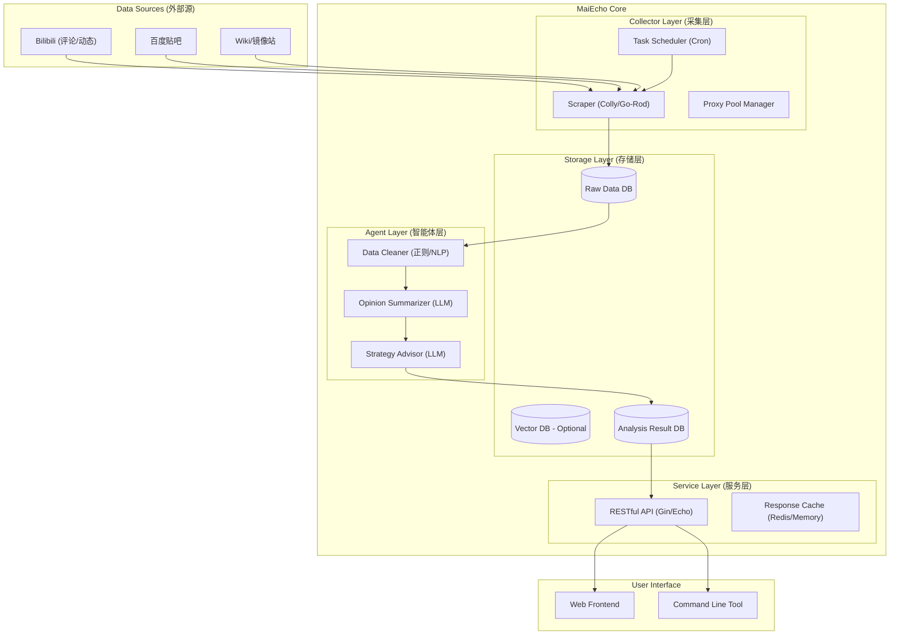
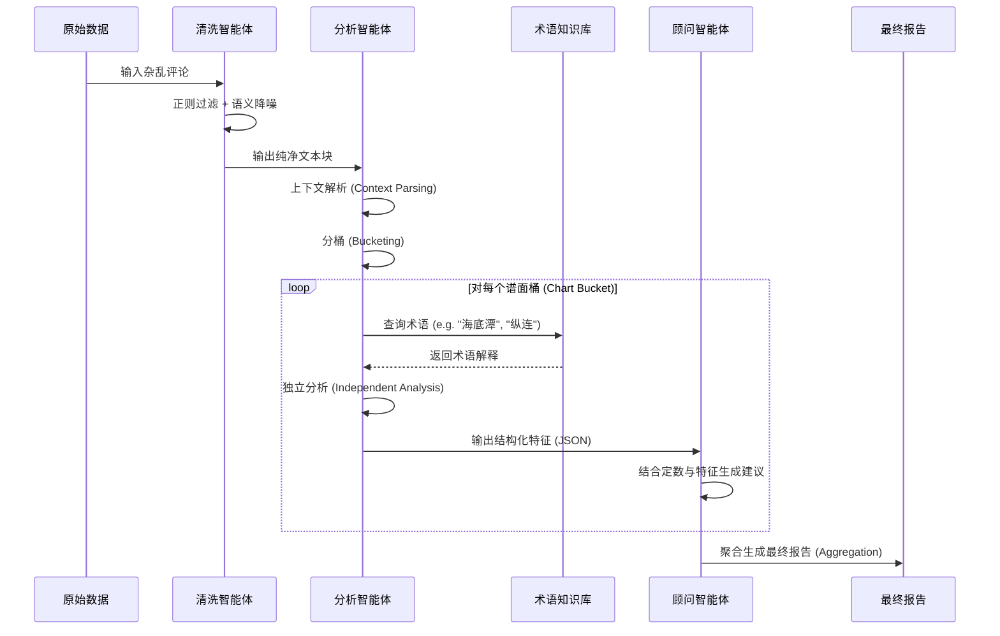

# MaiEcho 技术架构与智能体规划文档

## 1. 项目概述 (Overview)

**MaiEcho** 是一个基于 Golang 开发的开源音游舆情分析智能体框架。本项目旨在通过收集社交媒体上关于 maimai 乐曲与谱面的玩家评价，利用大语言模型进行深度语义分析，去除噪声，提取核心观点，最终为玩家提供结构化的谱面简介、难点分析及推分（Rating）建议。

## 2. 系统架构设计 (System Architecture)

MaiEcho 采用模块化微服务架构思想，但在初期作为单体应用（Monolith）开发以降低部署复杂度。系统主要由数据采集层、持久化层、智能分析层和应用服务层组成。

### 2.1 架构图 (Architecture Diagram)



### 2.2 核心模块说明

1. **Collector (采集器)**

   * **职责**: 负责从外部平台抓取非结构化文本数据。
   * **技术**: 使用 `gocolly/colly` 处理静态页面。
   * **策略**:
     * 实现指数退避算法（Exponential Backoff）和代理轮询。
     * **WAF 绕过**: 针对 Bilibili 实现了 Cookie 管理与请求头伪装。
     * **数据清洗**: 自动剥离 HTML 标签（如 `<em>`），提取纯文本。
     * **ID 稳定性**: 优先使用 `rpid` 作为评论唯一标识，确保去重准确。
2. **Storage (存储)**

   * **RawDB**: 存储原始抓取的评论数据。使用 **SQLite** 进行轻量级存储。
   * **ResultDB**: 存储分析后的结构化报告。支持 **细粒度存储**，通过 `TargetType` ('song'/'chart') 和 `TargetID` 区分存储粒度。
3. **Agent Core (智能体核心)**

   * **职责**: 系统的“大脑”，负责理解“音游黑话”并生成报告。
   * **技术**: 使用 `github.com/openai/openai-go` 。
   * **架构**: 采用 **"分桶分析" (Bucket Analysis)** 架构，解决不同谱面版本（DX/Std）与难度混淆的问题。
4. **Configuration (配置管理)**

   * **职责**: 统一管理应用配置。
   * **技术**: 使用 `spf13/viper`。
5. **Provider (外部数据提供商)**

   * **职责**: 封装与第三方 API 的交互逻辑，实现数据获取与适配。
   * **实现**: 目前集成了 **Diving-Fish** (水鱼查分器) API，用于同步乐曲列表、谱面定数及拟合难度统计数据。
   * **特性**: 支持 ETag 缓存以减少带宽消耗。
6. **Server (服务)**

   * **职责**: 提供 HTTP 接口，响应查询请求。
   * **技术**: Gin 框架。
   * **特性**: 支持 **聚合分析结果**，将歌曲维度的宏观评价与谱面维度的微观攻略组合返回。

## 3. 智能体框架规划 (Agent Framework)

MaiEcho 的核心在于其“智能体”能力，不仅仅是简单的文本摘要，而是模拟一位资深音游玩家的思维过程。

### 3.1 智能体角色定义 (Agent Roles)

系统内部将通过 Prompt Chain 串联多个专门的智能体角色：

1. **清洗专员 (The Cleaner)**

   * **任务**: 预处理原始数据。
   * **能力**: 识别并移除无意义的灌水（如“第一”、“前排”）、纯表情包回复、广告。
   * **特殊技能**: 识别音游特有的缩写、术语，并保留其上下文。
2. **舆情分析师 (The Analyst)**

   * **任务**: 从清洗后的数据中提取关键特征。
   * **输入**: 100条关于《PANDORA PARADOXXX》的评论。
   * **输出**: 结构化标签。例如：`{ "难度感": "极高", "主要难点": ["流星雨段", "回旋楼梯"], "好评点": ["谱面写意", "练底力"], "差评点": ["配置由于"] }`。
3. **谱面顾问 (The Advisor)**

   * **任务**: 基于分析师的报告，生成最终建议。
   * **Persona**: 语气亲切、鼓励性质的资深玩家。
   * **输出**: “这首歌定数 13.7，但实际体感有 13.9。主要难点在于后半段的纵连，建议底力不足的玩家先去练习《Garakuta》红谱。推分建议：鸟加（SSS+）难度较大，但 SSS 相对容易。”

### 3.2 认知工作流 (Cognitive Workflow)



### 3.3 提示词工程策略 (Prompt Engineering Strategy)

为了让 AI 理解音游黑话，我们需要构建一个 **System Prompt** 模板：

```text
你是一个精通街机音游 maimai (舞萌) 的资深玩家和谱面分析师。
你的任务是分析其他玩家对特定乐曲谱面的评价。

请注意以下术语的含义：
- 鸟/鸟加: SSS / SSS+ 评价
- 绝赞: 游戏中的 Perfect 判定
- 纵连: 连续的纵向按键配置
- 交互: 左右手交替点击
- 糊: 指玩家看不清谱面，乱拍
- 越级: 挑战超过自己当前水平的谱面

请忽略关于排队、机器故障等与谱面本身无关的评论。
重点关注：谱面配置合理性、体感难度（相对于定数是诈称还是逆诈称）、易错段落。
```

## 4. 数据模型设计 (Data Model)

### 4.1 Song (乐曲信息)

```go
type Song struct {
    gorm.Model
    GameID      int         `gorm:"uniqueIndex" json:"id"` // 来自 Diving-Fish 的 ID
    Title       string      `gorm:"index" json:"title"`
    Type        string      `json:"type"` // DX or 标准
    Artist      string      `json:"artist"`
    Genre       string      `json:"genre"`
    BPM         float64     `json:"bpm"`
    ReleaseDate string      `json:"release_date"`
    Version     string      `json:"version"` // 乐曲更新版本
    IsNew       bool        `json:"is_new"`
    CoverURL    string      `json:"cover_url"`
    Charts      []Chart     `json:"charts,omitempty"`
    Aliases     []SongAlias `json:"aliases,omitempty"`
}

type Chart struct {
    gorm.Model
    SongID         uint    `gorm:"index" json:"song_id"`
    Difficulty     string  `json:"difficulty"` // Basic, Advanced, Expert, Master, Re:Master
    Level          string  `json:"level"`      // 13, 13+, 14, etc.
    DS             float64 `json:"ds"`         // Internal decimal level
    Notes          string  `json:"notes"`      // JSON array: [tap, hold, slide, touch, break]
    Charter        string  `json:"charter"`    // NotesDesigner
    FitDiff        float64 `json:"fit_diff"`
    AvgAchievement float64 `json:"avg_achievement"`
    AvgDX          float64 `json:"avg_dx"`
    StdDev         float64 `json:"std_dev"`
    SampleCount    int     `json:"sample_count"`
}
```

### 4.2 Comment (原始评论)

```go
type Comment struct {
    gorm.Model
    Source      string    `gorm:"index" json:"source"` // Bilibili, Tieba, etc.
    SourceTitle string    `json:"source_title"`        // Title of the source (e.g. Video Title)
    ExternalID  string    `gorm:"index" json:"external_id"`
    Content     string    `json:"content"`
    Author      string    `json:"author"`
    PostDate    time.Time `json:"post_date"`
    SongID      *uint     `gorm:"index" json:"song_id,omitempty"`
    ChartID     *uint     `gorm:"index" json:"chart_id,omitempty"`
    SearchTag   string    `gorm:"index" json:"search_tag"` // The keyword used to find this comment
    Sentiment   float64   `json:"sentiment"`               // -1.0 to 1.0
}
```

### 4.3 AnalysisResult (分析结果)

```go
type AnalysisResult struct {
    gorm.Model
    TargetType         string `gorm:"index" json:"target_type"` // Song or Chart
    TargetID           uint   `gorm:"index" json:"target_id"`
    Summary            string `json:"summary"`
    RatingAdvice       string `json:"rating_advice"`
    DifficultyAnalysis string `json:"difficulty_analysis"`
    ReasoningLog       string `json:"reasoning_log" gorm:"type:text"` // 存储 LLM 的推理过程
}
```

### 4.4 Video (视频元数据)

```go
type Video struct {
    gorm.Model
    Source      string    `json:"source"`                         // 例如： "Bilibili"
    ExternalID  string    `gorm:"uniqueIndex" json:"external_id"` // 例如： "BV..."
    Title       string    `json:"title"`
    Description string    `json:"description"`
    Author      string    `json:"author"`
    URL         string    `json:"url"`
    PublishTime time.Time `json:"publish_time"`
}
```

## 5. 项目目录结构 (Directory Structure)

```
MaiEcho/
├── client/               # 前端代码 (供演示使用)
├── docs/                 # 文档
├── server/               # 后端服务代码
│   ├── cmd/
│   │   └── maiecho/      # 主程序入口 (Monolith)
│   ├── config/           # 配置文件 (config.yaml)
│   ├── internal/
│   │   ├── agent/        # 智能体业务逻辑 (Prompt构建, 结果解析)
│   │   ├── collector/    # 数据采集 (数据爬虫)
│   │   ├── config/       # 配置管理 (Viper)
│   │   ├── controller/   # HTTP 路由处理
│   │   ├── llm/          # LLM 客户端封装 (OpenAI-Go / DashScope)
|   |   ├── logger/       # 日志封装
│   │   ├── model/        # 数据模型定义
│   │   ├── provider/     # 第三方服务API集成 (Diving-Fish API)
│   │   ├── router/       # 路由定义
│   │   ├── scheduler/    # 任务编排
│   │   ├── service/      # 业务逻辑层
│   │   ├── status/       # 状态监测
│   │   └── storage/      # 数据库操作 (SQLite)
│   └── go.mod
├── go.mod                # (根目录 go.mod)
└── README.md
```
