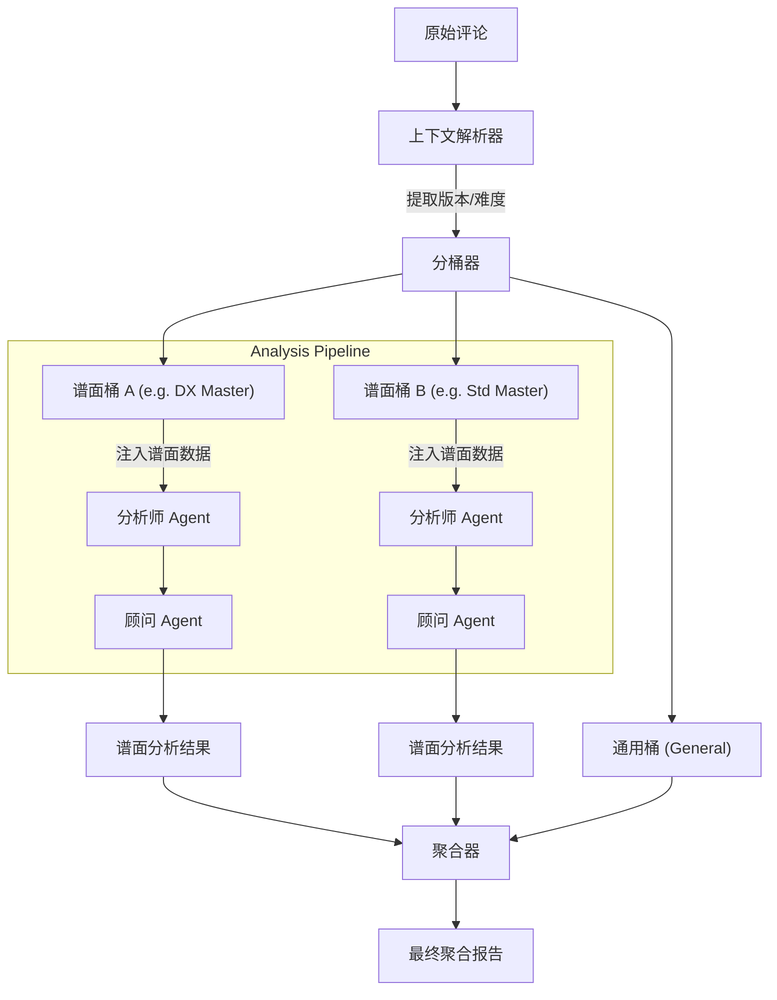

# Agent 模块 (Smart Agent)

## 1. 结构 (Structure)

* `analyzer.go`: 核心分析器逻辑，负责协调数据获取、清洗、分桶、LLM 调用和结果存储。
* `cleaner.go`: 数据清洗组件，负责预处理原始评论数据（去除噪声、格式化）。
* `mapper.go`: 映射组件，负责将评论关联到具体的歌曲（基于标题、别名和 LLM 验证）。
* `knowledge.go`: 知识库组件，负责管理音游术语和动态注入 Prompt。
* `relevance.go`: 相关性检查组件。
* `prompts.yaml`: 定义所有 Agent 的 System/User Prompt 模板。

## 2. 核心架构：分桶分析 (Bucket Analysis Architecture)

为了解决不同谱面版本（DX/Std）和难度（Master/Re:Master）评论混杂的问题，Agent 模块采用了“先分桶，后分析，再聚合”的策略。

### 2.1 关键流程

1. **上下文解析 (Context Parsing)**:

   * 分析评论来源标题（如 `[DX] 某某曲 Master AP手元`）。
   * 提取元数据：`Version` (DX/Std), `Difficulty` (Master/Re:Master/Expert)。
   * 过滤非官方内容（自制、宴、UGC）。
2. **谱面映射 (Chart Mapping)**:

   * 将解析后的评论分配给对应的 `ChartID`。
   * 无法明确归类的评论放入“通用桶”。
3. **独立分析 (Independent Analysis)**:

   * 对每个非空的谱面桶独立运行 `Analyst` + `Advisor` 流程。
   * **数据注入**: 为每个谱面注入特定的官方定数 (DS) 和拟合定数 (FitDiff)，引导 LLM 分析“诈称/逆诈称”。
4. **结果存储 (Granular Storage)**:

   * `TargetType="song"`: 存储歌曲级总览。
   * `TargetType="chart"`: 存储特定谱面的详细分析。

## 3. 功能 (Functionality)

* **舆情分析**: 接收歌曲 ID，获取相关评论，生成结构化的分析报告。
* **数据清洗**: 移除无意义的评论，过滤非官方谱面内容。
* **智能映射**: 基于歌曲标题和别名进行评论匹配。
* **知识增强**: 动态注入音游术语解释。
* **定数分析**: 结合 Diving-Fish 的拟合定数数据，分析谱面实际难度与官方标定的差异。

## 4. 依赖关系 (Dependencies)

* `internal/llm`: 用于执行 AI 推理。
* `internal/storage`: 用于读取歌曲/评论数据，存储分析结果。
* `internal/model`: 使用共享的数据模型。

## 5. 开发进度 (Status)

* [X]  基础分析流程 (`AnalyzeSong`)。
* [X]  数据清洗器 (`Cleaner`)。
* [X]  知识库注入 (`KnowledgeBase`)。
* [X]  **评论分桶与谱面映射** (Context Parsing & Mapping)。
* [X]  **细粒度谱面分析** (Chart-Specific Analysis)。
* [X]  **聚合结果 API**。

## 6. 待办事项 (Todo)

* [ ]  Optimization: 引入 Token 计数器，动态调整发送给 LLM 的评论数量。
* [ ]  Feature: 实现 DX 与 Std 版本的对比分析 Agent（当两者都存在时）。
* [ ]  Refactor: 进一步优化 Prompt，提高对“手感”类评价的提取准确度。
