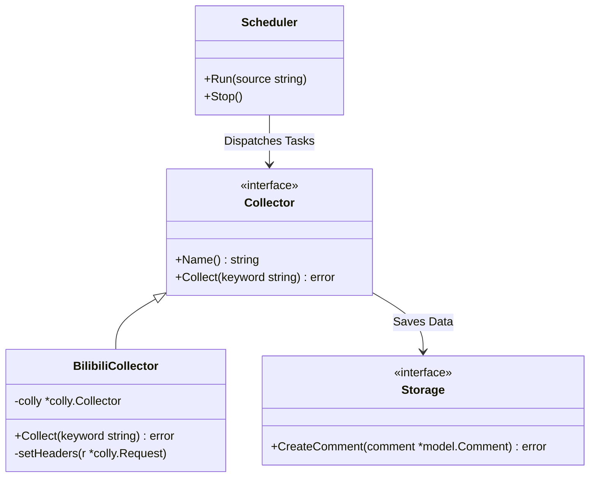
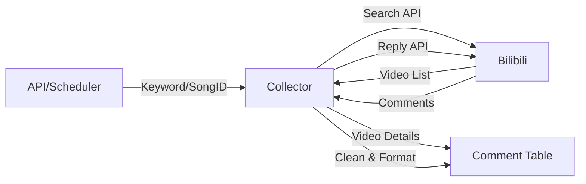

# MaiEcho 采集模块 (Collector)

## 1. 设计目标

构建一个可扩展、高可用的数据采集系统，用于从 Bilibili、贴吧等平台抓取舞萌（maimai）相关的舆情数据（评论、动态、帖子）。

## 2. 模块结构 (Structure)

*   `collector.go`: 定义 `Collector` 接口和通用类型。
*   `bilibili.go`: Bilibili 平台的采集实现。负责针对特定关键词或 SongID 抓取视频及其评论。
*   `bilibili_discovery.go`: Bilibili 内容发现服务。负责扫描特定标签（如 "maimai", "舞萌DX"）以发现新发布的视频。

## 3. 核心架构

采集模块采用 **"Scheduler - Collector - Storage"** 的架构模式。



### 接口定义

位于 `server/internal/collector/collector.go`。

```go
type Collector interface {
    // Name 返回采集器名称 (e.g., "bilibili", "tieba")
    Name() string
  
    // Collect 执行采集任务
    // keyword: 搜索关键词 (通常是乐曲名)
    Collect(ctx context.Context, keyword string) error
}
```

## 4. 核心功能与策略

### 4.1 数据采集 (Data Collection)

*   **多级采集**: 支持从“搜索结果 -> 视频详情 -> 评论列表”的深度采集。
*   **上下文关联**: 在采集过程中传递 `song_id`，确保采集到的评论能直接关联到数据库中的歌曲。
*   **数据清洗**:
    *   **HTML 标签去除**: 自动去除 Bilibili API 返回标题中的高亮标签（如 `<em class="keyword">`），确保 `source_title` 纯净。
    *   **ID 标准化**: 使用 Bilibili 评论的 `rpid` 作为全局唯一的 `external_id`，避免 ID 冲突。

**数据流向**:



### 4.2 Bilibili 采集策略

*   **搜索策略**:
    *   关键词组合: `乐曲名 + "maimai"`, `乐曲名 + "鸟"`, `乐曲名 + "手元"`。
    *   API 调用: 优先尝试调用 Bilibili Web API (如 `/x/web-interface/search/all`) 获取视频列表。
*   **数据映射**:
    *   `Source`: "Bilibili"
    *   `ExternalID`: `bvid` + `comment_id`
    *   `Content`: 评论内容 / 视频简介
    *   `Author`: 用户昵称

### 4.3 反爬虫与 WAF 绕过 (Anti-Scraping)

针对 Bilibili 的 `412 WAF` 拦截，实现了以下策略：

*   **请求伪装**:
    *   **User-Agent**: 使用真实的浏览器 UA。
    *   **Referer**: 设置为 `https://www.bilibili.com/` 或模拟从搜索页跳转。
    *   **Cookie**: 构造必要的 Cookie 字段 (e.g., `SESSDATA`, `bili_jct`) 或注入用户 Cookie。
*   **行为控制**:
    *   **异步并发**: 使用 `colly.Async(true)` 提高效率。
    *   **随机延迟**: 在请求间引入随机延迟 (Random Delay)，模拟人类行为。
    *   **自动熔断**: 检测到 412/403 错误时自动标记为 Banned 状态并停止采集，保护 IP。

## 5. 技术选型

*   **框架**: `gocolly/colly/v2`
    *   *理由*: Go 社区最成熟的爬虫框架，支持 Cookie 管理、限流、代理，且性能优异。
*   **JSON 解析**: `tidwall/gjson` (用于快速提取 API JSON 数据)。

## 6. 未来扩展 (Future Plans)

### 6.1 小红书 (Xiaohongshu)
*   **挑战**: 强反爬，页面内容高度依赖动态渲染。
*   **技术方案**: 计划使用 `Go-Rod` (Headless Chrome) 模拟真实用户行为。
*   **搜索策略**: 关键词 `maimai 乐曲名` / `舞萌 乐曲名`。

### 6.2 抖音 (Douyin)
*   **挑战**: 视频流媒体，评论区加密混淆严重。
*   **技术方案**: 推荐使用 `Go-Rod` 进行自动化操作。

### 6.3 待办事项
*   [ ] **代理池集成**: 接入外部代理池服务，解决高频采集下的 IP 封禁问题。
*   [ ] **增量采集**: 基于 `last_scraped_time` 实现增量更新，避免重复抓取历史评论。
*   [ ] **多平台支持**: 百度贴吧 (Tieba)、小红书 (XHS)。

## 7. 开发进度 (Status)

*   [x] `Collector` 接口定义。
*   [x] Bilibili 基础采集器 (Search & Reply)。
*   [x] Bilibili 发现采集器 (Discovery)。
*   [x] **数据清洗增强** (HTML Tag Removal)。
*   [x] **ID 策略优化** (Unique ExternalID)。
